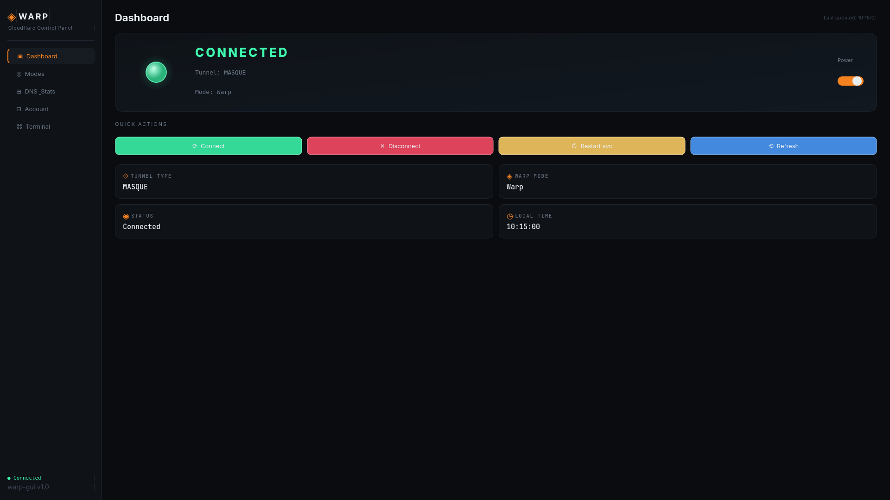

# WARP Control — Linux GUI for Cloudflare WARP

I use Cloudflare WARP a LOT because of how my school network is configured (I'm in a boarding school so I need the school wifi to work properly 😭), but I use Linux as a daily desktop driver, and Cloudflare WARP doesn't have an official GUI for linux other than the Zero Trust version which I'm too lazy to set up an account for, so I used warp-cli for a while which became annoying since I had to spam `warp-cli status` to see if I was connected yet, and I couldn't see my current mode, I had to guess or reset it, so I decided to create my own GUI in python.

**DISCLAIMER:** Since I started this project during my exams, I used Claude's help for a LOT of this app's functions, forgive me for vibe coding 😓, but don't worry, more human updates will come soon once I'm done with exams since this is full of bugs and incomplete features, even the README.md needs fixing.

A sleek, dark-themed desktop GUI for managing Cloudflare WARP on Linux — since the official client ships with no GUI.

## Screenshots
Dark terminal-inspired UI with sidebar navigation, animated status orb.


## Features

| Feature | Description |
|---------|-------------|
| **Live Status** | Animated orb + auto-refreshes |
| **Connect / Disconnect** | One-click toggle or big power switch |
| **Mode Switcher** | WARP, DoH, WARP+DoH, DoT, Proxy, Tunnel-only |
| **DNS Stats** | View live DNS query stats from warp-cli |
| **Settings View** | See all current warp-cli settings |
| **Account Panel** | Register, delete, apply WARP+ license keys |
| **Rotate Keys** | Rotate WireGuard keys from the UI |
| **Command Terminal** | Run any `warp-cli` command with quick-pill shortcuts |
| **Status in Sidebar** | Always-visible connection state |
| **Clock Widget** | Live local time in the dashboard |

## Requirements

- Python 3.8+
- PyQt6 (`pip install PyQt6`)
- `warp-cli` installed (from Cloudflare's official repo)

## Install

### 1. Clone the repo and cd into it
```bash
git clone https://github.com/yousseftechdev/warp-gui-linux
cd warp-gui-linux
```

### 2. Run the install script
```bash
chmod +x install.sh
./install.sh
```

### 3. Launch the app!
1. Either through the terminal with the command `warp-gui`
2. Or through your app launcher/menu, it will be called `WARP Control`

## Notes
<!-- - Restarting `warp-svc` uses `pkexec` (polkit) — a password prompt will appear. -->
- All other operations run as your normal user via `warp-cli`.